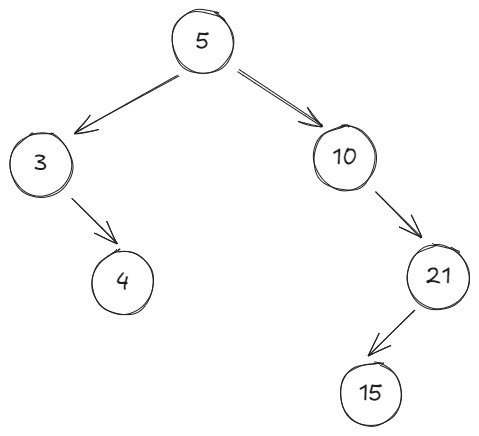
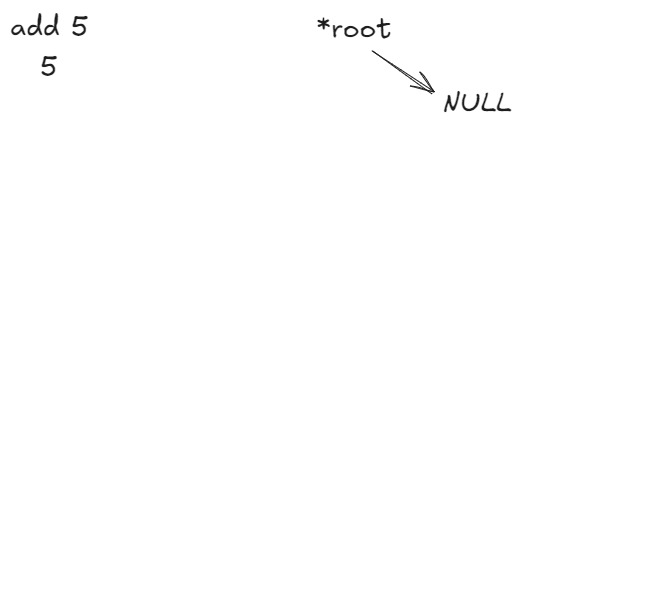

# Binary Search Tree
A binary search is a data structure that uses nodes that are connected to other nodes.
Since its binary each node is connect to two other nodes.


## Structure
```c
typedef struct node* nodeptr;
struct node{
    int val;
    nodeptr left;
    nodeptr right;
}
```

##### val
val is the data of the node it can be any datatype or struct
##### left
The left node of the current node. the left node's **val** is always less than the current node's **val**
##### right
The right node of the current node. the right node's **val** is always greater than the current node's **val**

## BST Operations
### Add
The function adds a new node to the current tree.
```c
void add_Node(nodeptr *root, int val){
    nodeptr node = *root, parent;
    nodeptr new_node = malloc(sizeof(nodeptr));
    new_node->val = val;
    new_node->left = NULL;
    new_node->right = NULL;
    while(node != NULL){
        parent = node;
        if(val < node->val)
            node = node->left;
        else
            node = node->right;
    }
    if(parent == NULL)
        *root = new_node;
    else if(val < parent->val)
        parent->left = new_node;
    else
        parent->right = new_node;
}
```
##### node
The node we use to traverse the tree.
##### parent
The parent node of **node**. We use it so when node is NULL we know where to insert **new_node**
##### new_node
The new node to insert


### Delete
The function deletes node inside the tree.
This is not one function but many functions inside one.
### Delete Sub Function
#### Search Delete
The functions returns a boolean if the function finds the node.
Uses two double pointers for **parent** and **node**.
```c
bool searchDelete_Node(nodeptr *node, nodeptr *parent, int key){
    bool found = false;
    while (!found == (*ptr != NULL)){
        if(key == (*node)->val)
            found = true;
        else{
            *parent = *node;
            if(key < (*node)->val)
                *node = (*node)->left;
            else
                *node = (*node)->right;
        }
    }
}
```
#### Delete Leaf
The functions frees a node with no children, 
and cuts the connection between the node and its parent.
```c
void deleteLeaf_Node(nodeptr *root, nodeptr *node, nodeptr *parent){
    if(*parent == NULL)
        *root = NULL;
    else if((*node)->val < (*parent)->val)
        (*node)->left = NULL;
    else
        (*node)->right = NULL;
    free(*node);
}
```

#### Delete Child
The function frees a node with one child,
and connects the child of **node** to **parent**.
```c
void deleteChild_Node(nodeptr *root, nodeptr *node, nodeptr *parent){
    if(*parent == NULL)
        if((*root)->right == NULL)
            *root = (*root)->left;
        else
            *root = (*root)->right;
    if((*node)->val < (*parent)->val)
        if((*node)->right == NULL)
            (*parent)->left = (*node)->left;
        else
            (*parent)->left = (*node)->right;
    else
        if((*node)->right == NULL)
            (*parent)->right = (*node)->left;
        else
            (*parent)->right = (*node)->right;
    free(*ptr);
}
```

#### Delete Children
The function frees a node with two children.
Because **node** has two children we cant just use one of the children to swap with **node**.
So we have to use the nodes **inOrder** predecessor.

```c
void deleteChildren_Node(nodeptr *node nodeptr *parent){
    nodeptr successor;
    *parent = (*node)->right;
    while((*parent)->left != NULL){
        successor = *parent;
        *parent = (*parent)->left;
    }
    (*node)->val = (*parent)->num;
    if(successor == NULL)
        if((*parent)->right == NULL)
            (*node)->right = NULL;
        else
            (*node)->right = (*parent)->right;
    else
        if((*parent)->right = NULL)
            successor->left = NULL;
        else
            successor->left = (*parent)->right;

    free(*parent);
}
```
