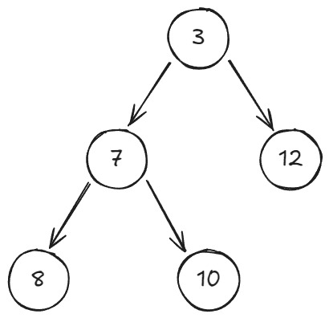
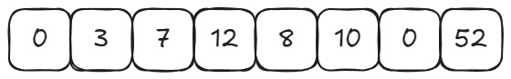
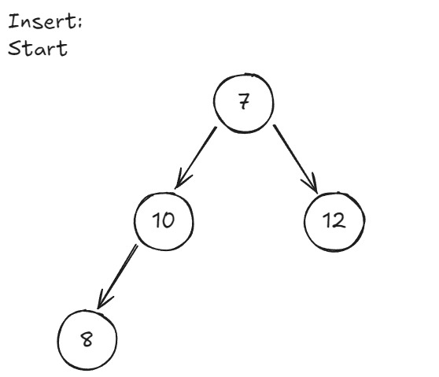

# Heap

A heap is a type of queue that after inserting arranges the data so either
the least or greatest value is in the first index(Min heap or Max heap).

## Heap Versions

### Tree

### Array


## Heap Array
```c
typedef struct{
    int arr[SIZE];
    int hsize;
}Heap;
```


#### arr
the array of the Heap.

#### hsize
the current size of the heap.

## Heap Operations
### Insert
The function adds a value at the end of the heap and arranges it by size.
```c
void insert(Heap *heap, int val){
    int j = ++heap->hsize;
    while(heap->arr[j/2] > val){
        heap->arr[j] = heap->arr[j/2];
        j /= 2;
    }
    heap->arr[j] = val;
}
```


### Delete
The function returns the first index of the heap and removes it from the array.

```c
void delete(Heap *heap){
    int val = heap->arr[heap->hsize--];
    heapify(1, heap->arr, hsize);
    return val;
}
```
### Heapify
The function moves the item in the last index and moves it down the heap
to the right index.
```c
void heapify(int index, int arr[], int hsize){
    int left = index*2;
    int right = index*2 + 1;
    int smallest;

    if(left < hsize && arr[left] < arr[index])
        smallest = left;
    else
        smallest = index;
    if(right < hsize && arr[right] < arr[smallest])
        smallest = right;
    if(smallest != index){
        int temp = arr[smallest];
        arr[smallest] = arr[index];
        arr[index] = arr[temp];

        heapify(smallest, arr, hsize);
    }
}

```
### IsFull
The function checks if the heap is full.
```c
bool isFull(int hsize){
    bool full = false;
    if(hsize == SIZE)
        full = true;
    return full;
}
```

### IsFull
The function checks if the heap is full.
```c
bool isEmpty(int hsize){
    bool empty = false;
    if(hsize == 0)
        empty = true;
    return empty;
}
```
