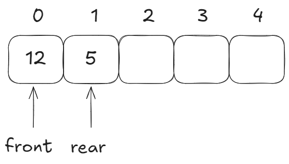
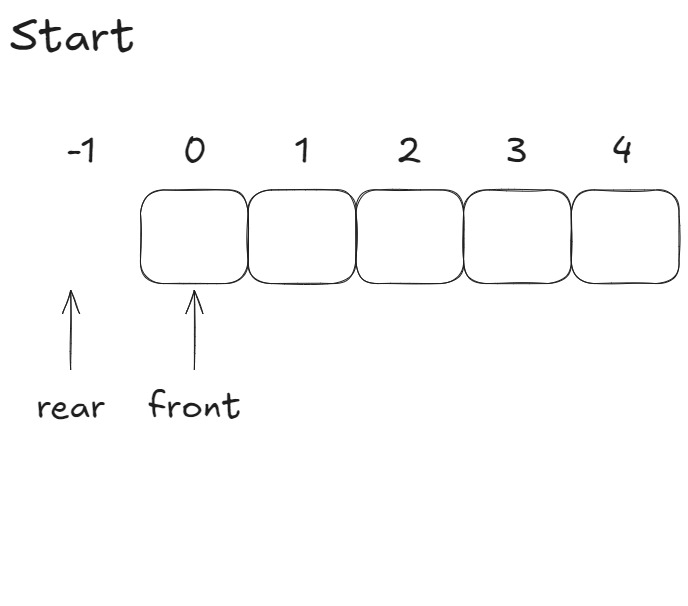
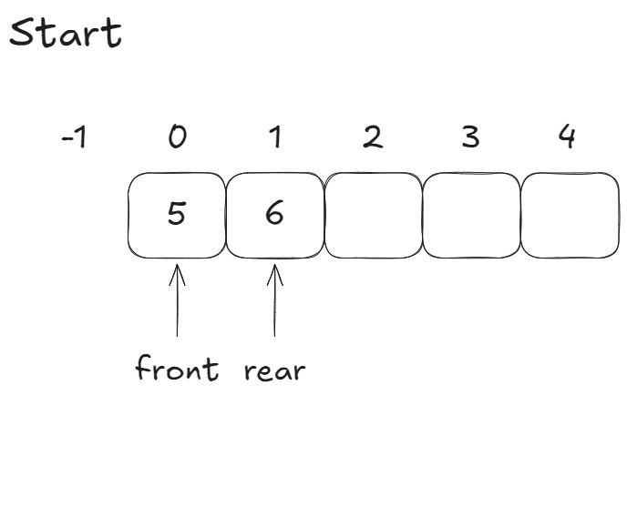

# Queue

A queue is a list with the restriction that you can insert at the front of the list
and you can delete at the end of the list.

## Linear Queue Array
```c
typedef struct{
    int que[size];

    int front;
    int rear;
} Queue;
```
#### que
The actual array of Queue.

#### front
The front of the Queue, this is where you ### [EnQueue] in the Queue.
front starts at index 0.

#### rear
The rear of the Queue, this is where you ### [DeQueue] in the Queue.
rear starts at index -1.



## Queue Operataions
### EnQueue
The function increases rear and inserts a value in that index.
```c
void EnQueue(Queue* queue, int val){
    queue->rear += 1;
    queue->que[queue->rear] = val;
}
```

### DeQueue
The function saves front in data; increments front; and returns data.
```c
int DeQueue(Queue* queue){
    int data queue->que[queue->front];
    queue->front += 1;
    return data;
}
```


### IsFull
 The function check if the Queue is full by checking if rear is equal to size.
```c
bool isFull(int rear){
    bool full = false;
    if(rear == size-1)
        full = true;
    return true;
}
```

### IsEmpty
 The function check if the Queue is empty by checking if front is greater than rear.
```c
bool isEmpty(int rear){
    bool empty = false;
    if(rear+1 == front)
        empty = true;
    return true;
}
```
## Reference
### Circular Version
[Circular Queue](CQueue.md)
### Linked List Version
[Queue linked List](Queue_LinkedList.md)

[Back To Main](readme.md)
