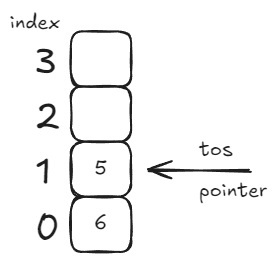
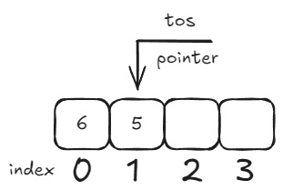
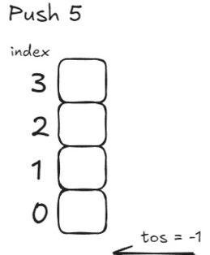
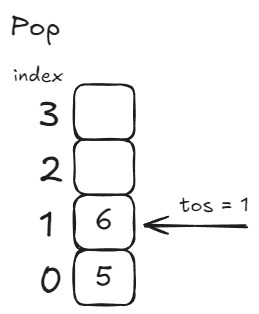

# Stacks

A stack is a list with the restriction that inserts and deletes
can only be performed on the top of the list.
## Stack Array Version
```c
typedef Struct{
int tos;
int stk[size];
} Stack;
```
#### tos(top of stack)
The index where the top most/left most value of an array.
#### stk
The actual array of the Stack

#### Vertical version

#### Horizontal version


## Stack Operations
### Push
The function increases the tos by 1 and adds a value in that index.
```c
void push(Stack* stack, int val){
	stack->tos += 1;
	stack->stk[stack->tos] = val;
}
```

### Pop
The function outputs the value in tos and moves tos lower by 1.
```c
int pop(Stack* stack){
	int data = stack->stk[stack->tos];
	stack->tos -= 1;
	return data;
}
```

``` 
Even though the numbers are not removed in the array because its above tos, we cant really see them anymore.
```
### IsFull
Functions checks if the stack is full by checking if tos is equal to the last index.
```c
bool isFull(int tos){
	bool full = false;
	if(tos == size - 1){
		full = true;
	}
	return full;
}
```
### IsEmpty
Functions checks if the stack is empty by checking if tos is equal to -1.
```c
bool isEmpty(int tos){
	bool empty = false;
	if(tos == -1){
		empty = true;
	}
	return empty;
}
```

### Peak
Function will output the value in tos but will not move tos.
```c
int peak(Stack stack){
	int data = stack.stk[stack.tos];
	return data;
}
```
## References
### Linked List Version
["Stack Linked List"](Stack_LinkedList.md)
### Examples
