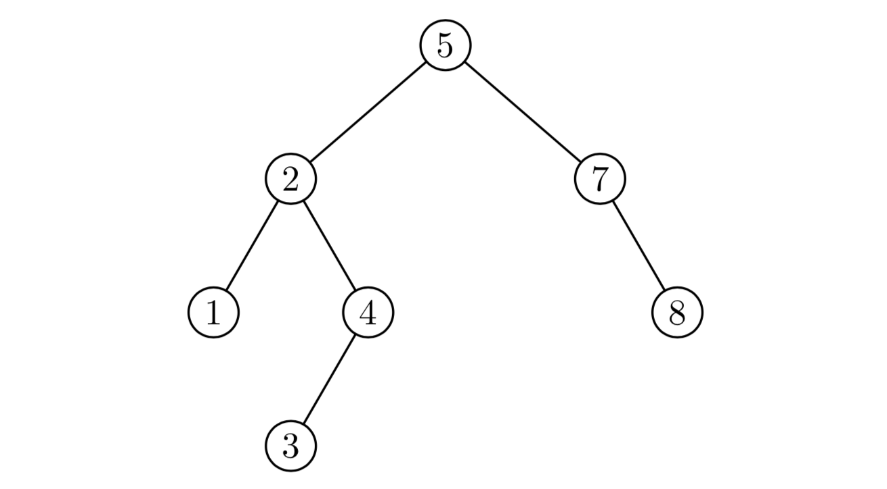

# Essay
1. In algorithm analysis what are we measuring.

2. What are two operations that are not counted in algorithm analysis.

3. If an algorithm has one nested for loop 
what is the run time of the of algorithm.

4. Why do we do algorithm analysis.

5. What is the Average case of an algorithm.

6. What is the worst case of an algorithm with an if else statement.

7. What are input classes.

8. In doing algorithm analysis 
what are the two important aspects we are looking for.

9. What is an algorithm

10. Why do we remove lower order terms and leading constants in the final running time.

# Solve
Remember all inputs must be **positive** integers.

1.
```c
int sumArr(int arr[], int n){
    int total = 0;
    for(int  i = 0; i < n; i++){
        total += arr[i+0];
    }
    return total;
}
```
2.
```c
int addEven(int arr[], int n){
    int total = 0;
    for(int i = 0; i < n; i++){
        if(arr[i]%2 == 0)
            total++;
    }
    return total;
}
```
3.
```c
bool hasOdd(int arr[], int n){
    bool even = false;
    for(int i = 0; i < n; i++){
        if(arr[i]%2){
            even = true;
            break;
        }
    }
    return even;
}
```
4. The max number inside the array is n, do the best case.
Bonus you can do the worst case.
```c
void countSquare(int arr[], int n){
    int total = 0;
    for(int i = 0; i < n; i++){
        bool square = true;
        int j = arr[i];
        while(square && j != 0){
            if(j%2 != 0){
                square = false;
            }
            j /= 2;
        }
        if(square)
            total++;
    }
    return total;
}
```
5.
```c
void print(int arr[], int n){
    for(int i = 0; i < n; i++){
        int temp = 1; 
        for(int j = 0; j<5; j++){
            temp *= arr[i];
        }
        arr[i] = temp;
    }
}
```

# Simulate

1. 
|5|4|3|2|1|
|-|-|-|-|-|
|‎|‎|‎|‎|‎|
|‎|‎|‎|‎|‎|
|‎|‎|‎|‎|‎|
|‎|‎|‎|‎|‎|
|‎|‎|‎|‎|‎|
```c
void bubbleSort(arr[], int n){
    for(int i = 0; i<n-1; i++){
        bool swapped = false
        for(int j = 0; j<(n-i-1); j++){
            if(arr[j] > arr[j+1]){
                arr[j+1] += arr[j];
                arr[j] = arr[j+1] - arr[j];
                arr[j+1] = arr[i] - arr[j];
                swapped = true;
            }
        }
        if(!swapped)
            break;
    }
}
```
2. 
|5|4|3|2|1|
|-|-|-|-|-|
|‎|‎|‎|‎|‎|
|‎|‎|‎|‎|‎|
|‎|‎|‎|‎|‎|
|‎|‎|‎|‎|‎|
|‎|‎|‎|‎|‎|

```c
void insertionSort(int arr[], int n){
    for(int i = 0; i<n; i++){
        int temp = arr[i];
        int j;
        for(j = i-1; j >= 0; j--){
            if(temp>= arr[j]){
                break;
            }
            arr[j+1] = arr[j];
        }
        arr[j+1] = temp;
    }
}
```
3. Write the printed output.

```c
typedef struct node* nodeptr;
struct node{
    int val;
    noeptr left, right;
};

void InOrder(nodeptr node){
    if(node->left != NULL)
        InOrder(node->left);
    if(node->right != NULL)
        InOrder(node->right);
    printf("%d ", node->val);
}
```

